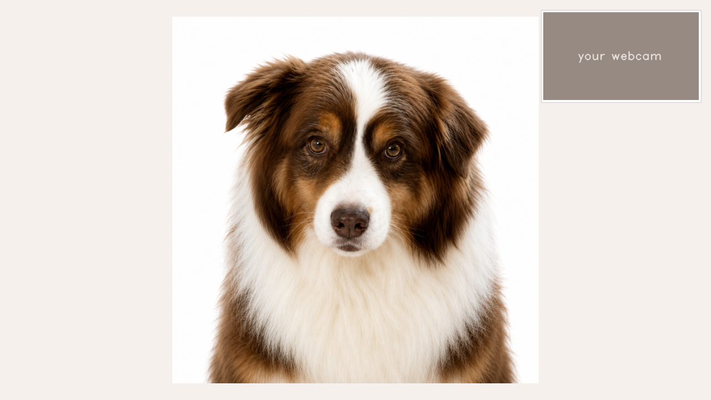
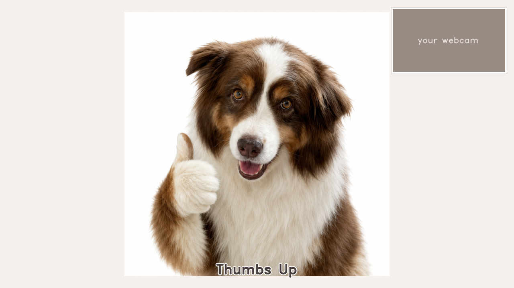
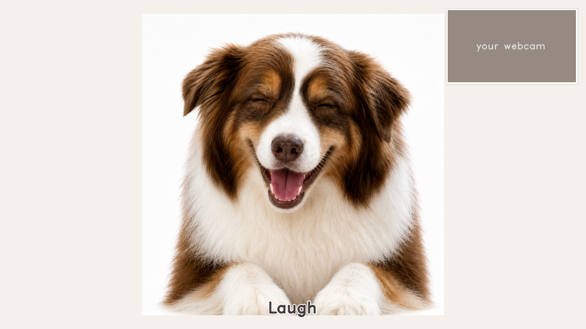
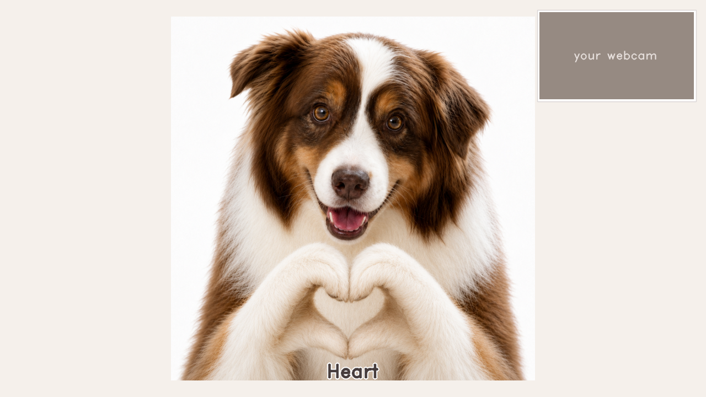
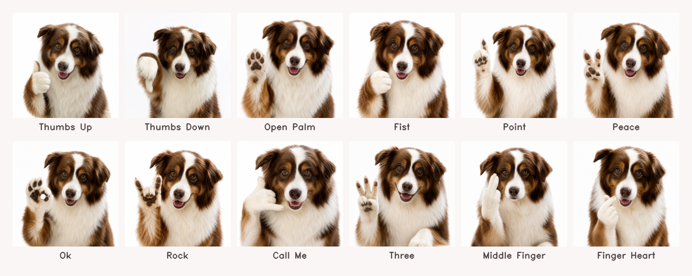
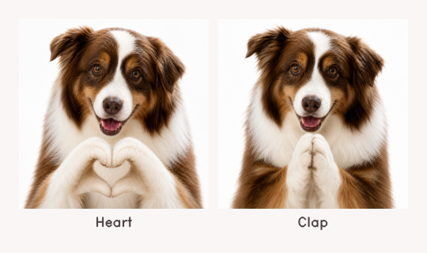
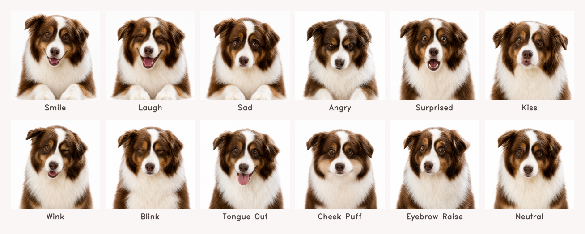

# Rio_meme

> 🌐 [English](README.md) · **简体中文**

一个用摄像头识别你的手势和表情、并自动弹出对应 **Rio**（澳牧犬）meme 的小玩具。比个耶——弹出比耶 Rio；吐舌头——弹出吐舌头 Rio；双手比心——弹出大爱心 Rio。

完全跑在本地，不联网、不上传任何画面。底层用 Google 的 MediaPipe Tasks API。



| 单手手势 | 面部表情 | 双手组合 |
|---|---|---|
|  |  |  |

---

## 快速开始

### macOS

1. 下载项目（点 Code → Download ZIP，或者 `git clone`）。
2. 双击 **`start.command`**。
3. 第一次双击可能弹出 *"无法验证开发者"* 的警告。解决：
   - **右键** `start.command` → 「打开」 → 在警告框里再点一次「打开」。
   - 或者：系统设置 → 隐私与安全性 → 拉到最下面 → **仍要打开**。
4. 启动脚本会自动：
   - 找系统里的 Python 3.9+，没有就帮你打开 python.org 安装页（或自动用项目里的 `python-installer.pkg`）。
   - 在项目目录建一个 `.venv/`，`pip install` opencv-python + mediapipe + numpy。
   - 下载两个 MediaPipe 模型文件（约 12 MB）。
   - 启动应用。
5. macOS 会弹摄像头权限请求 —— 点同意，然后**完全退出终端 App（Cmd+Q，不是关窗口）**，再双击 `start.command`（macOS 只把新权限发给新进程）。

第一次跑完所有东西都缓存好，之后双击 1-2 秒就启动。

### 其他平台

Linux / Windows 没有自动启动器，但应用本身是跨平台的：

```bash
python -m venv .venv
source .venv/bin/activate    # Windows: .venv\Scripts\activate
pip install opencv-python mediapipe numpy
curl -L -o gesture_recognizer.task https://storage.googleapis.com/mediapipe-models/gesture_recognizer/gesture_recognizer/float16/1/gesture_recognizer.task
curl -L -o face_landmarker.task   https://storage.googleapis.com/mediapipe-models/face_landmarker/face_landmarker/float16/1/face_landmarker.task
python hand_meme.py
```

按 **q** 或 **Esc** 退出。

---

## 能识别的事件（共 28 种）

### 单手手势 —— 14 种，每只手独立识别



`Thumb_Up` 👍 · `Thumb_Down` 👎 · `Open_Palm` ✋ · `Closed_Fist` ✊ · `Pointing_Up` ☝️ · `Victory` ✌️ · `OK` 👌 · `Rock` 🤘 · `Call_Me` 🤙 · `Three` 🤟 · `Middle_Finger` 🖕 · `Finger_Heart` 🫶 ·（`ILoveYou`、`Four` 可选）

前 7 个是 MediaPipe 内置的手势识别器；剩下 7 个是 [`hand_meme.py`](hand_meme.py) 里用 landmark 几何写的自定义分类器。

### 双手组合 —— 2 种



`Heart` 💕 · `Clap` 👏

只要双手组合触发，就会盖过单手 panel 优先显示。

### 面部表情 —— 12 种



`Smile`（微笑）· `Laugh`（大笑）· `Sad`（难过）· `Angry`（生气）· `Surprised`（惊讶）· `Kiss`（嘟嘴/亲）· `Wink`（单眼眨）· `Blink`（双眼闭）· `Tongue_Out`（吐舌头）· `Cheek_Puff`（鼓腮帮）· `Eyebrow_Raise`（挑眉）· `Neutral`（中性）

用 MediaPipe FaceLandmarker 输出的 52 个 ARKit blendshape 系数，套一组阈值规则判断。

---

## 工作原理

```
   摄像头帧
        │
        ├──► GestureRecognizer (gesture_recognizer.task)
        │        ├─► 每只手的内置标签
        │        └─► 每只手的 21 个 landmark ─► 自定义几何分类器
        │                                       │
        │                                       └─► OK / Rock / Call_Me / Three / Four /
        │                                            Finger_Heart / Middle_Finger
        │
        └──► FaceLandmarker   (face_landmarker.task)
                 └─► 52 个 blendshape 系数 ─► 规则化表情分类器
                                                       │
                                                       └─► Smile / Sad / Surprised / Kiss / …

   ┌───────────────────────────────────────────────────────────────────┐
   │  每通道时序去抖（Smoother — N 帧连续相同才锁定）                    │
   └───────────────────────────────────────────────────────────────────┘
                                       │
                                       ▼
              优先级选择：双手组合 > 最近一次变化的通道
                                       │
                                       ▼
                                显示对应 meme
```

完全 CPU 推理（XNNPACK delegate）。M1 Pro 上稳定约 30 FPS。

---

## 自定义 meme 图

每一个事件对应 [`memes/`](memes/) 里一张 PNG，文件名是固定的，把对应文件换掉、保持文件名不变、重启即可：

| 文件名 | 用途 |
|---|---|
| `thumbs_up.png` | 👍 Thumb_Up 手势 |
| `smile.png` | 😊 Smile 表情 |
| `heart.png` | 💕 双手 Heart 组合 |
| `kiss.png` | 😘 Kiss 表情 |
| `idle.png` | 默认 / 缺图时的兜底 |
| …… | （完整映射看 [`hand_meme.py`](hand_meme.py) 里的 `GESTURE_TO_MEME`、`TWO_HAND_COMBOS`、`EXPRESSION_TO_MEME`） |

某张图缺了不会崩，会自动 fallback 到 `idle.png` 并在终端打一条 WARNING。支持带 alpha 通道的透明 PNG（会合成到浅色背景上）。

---

## 调灵敏度

如果某个手势或表情触发不了 / 误触发，阈值都在这两个函数里：

- [`classify_custom_gesture`](hand_meme.py) —— OK / Rock / Call_Me / Three / Four / Finger_Heart / Middle_Finger 的几何规则。
- [`classify_expression`](hand_meme.py) —— 12 个表情的 blendshape 阈值规则。

每条规则上面都有注释解释依据。**阈值调小 = 更灵敏（容易触发）**；**阈值调大 = 更严格（不容易误触发）**。

双手组合的检测在 [`detect_two_hand_combo`](hand_meme.py)。

---

## 项目结构

```
Rio_meme/
├── start.command            ← macOS 双击启动
├── hand_meme.py             ← 主程序
├── memes/                   ← 每个事件对应的 PNG
├── tools/
│   └── make_screenshots.py  ← 重新生成 docs/ 里的预览图
├── docs/
│   └── screenshots/         ← README 用的展示图（不含真人面孔）
├── README.md / README.zh-CN.md
├── LICENSE
└── .gitignore               （排除 .venv、*.task、python-installer.pkg）
```

`.task` 模型文件和 `python-installer.pkg` **没有进 git**：
- 两个 `.task` 文件 `start.command` 会在首次启动时自动 `curl` 下载。
- `python-installer.pkg`（44MB）是分发给非技术朋友打包时**在本地放进去**的；GitHub 仓库里不带，避免膨胀。详见下方 [分发给朋友](#分发给朋友)。

---

## 分发给朋友

朋友电脑没装 Python？这样打包：

1. 去 <https://www.python.org/downloads/macos/> 下载 macOS 版的 Python `.pkg`，重命名为 `python-installer.pkg`，放在 `start.command` 旁边。
2. 把整个文件夹 zip 起来。
3. AirDrop / iMessage / 微信文件传输任选一种发过去。
4. 告诉她：解压后 **右键 `start.command` → 打开**（第一次必须这样，绕过 macOS 的 "Apple 无法验证" 警告，详见上面快速开始第 3 步）。

zip 大小约 100MB（Python 安装包 44MB + meme 图 ~50MB）。

---

## 致谢

- [MediaPipe Tasks](https://ai.google.dev/edge/mediapipe/solutions/guide) —— Google 的端侧 ML 框架。`gesture_recognizer` 和 `face_landmarker` 模型是整个项目的核心。
- 仓库里的 meme 图是用 ChatGPT 生成的 **Rio**（一只澳牧犬）。你可以换成任何你喜欢的图（或者你家的宠物）。

## 协议

MIT。详见 [`LICENSE`](LICENSE)。
